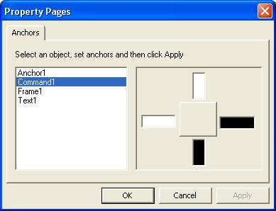



## Advanced Control Resizer & Positioner

### Description

Want to resize controls when form is resized? Want to save the position of the form and show it on exact position next time? Need to have the Anchor Control Like .NET and Delphi without using any Frame and other special controls? Need the fastest code and multiform supported control? Here is what you want! Please kindly let me know what you think about this control
 
### More Info
 

             |
---                |---
**Submitted On**   |2004-03-20 08:35:44
**By**             |[Hamed Oveisi](https://github.com/Planet-Source-Code/PSCIndex/blob/master/ByAuthor/hamed-oveisi.md)
**Level**          |Advanced
**User Rating**    |4.9 (69 globes from 14 users)
**Compatibility**  |VB 6\.0
**Category**       |[OLE/ COM/ DCOM/ Active\-X](https://github.com/Planet-Source-Code/PSCIndex/blob/master/ByCategory/ole-com-dcom-active-x__1-29.md)
**World**          |[Visual Basic](https://github.com/Planet-Source-Code/PSCIndex/blob/master/ByWorld/visual-basic.md)
**Archive File**   |[Advanced\_C1746945182004\.zip](https://github.com/Planet-Source-Code/hamed-oveisi-advanced-control-resizer-positioner__1-53861/archive/master.zip)

